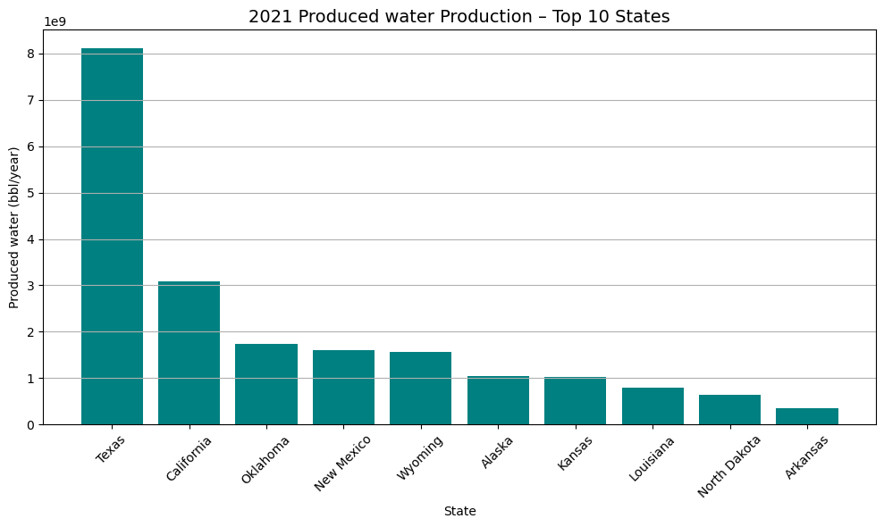
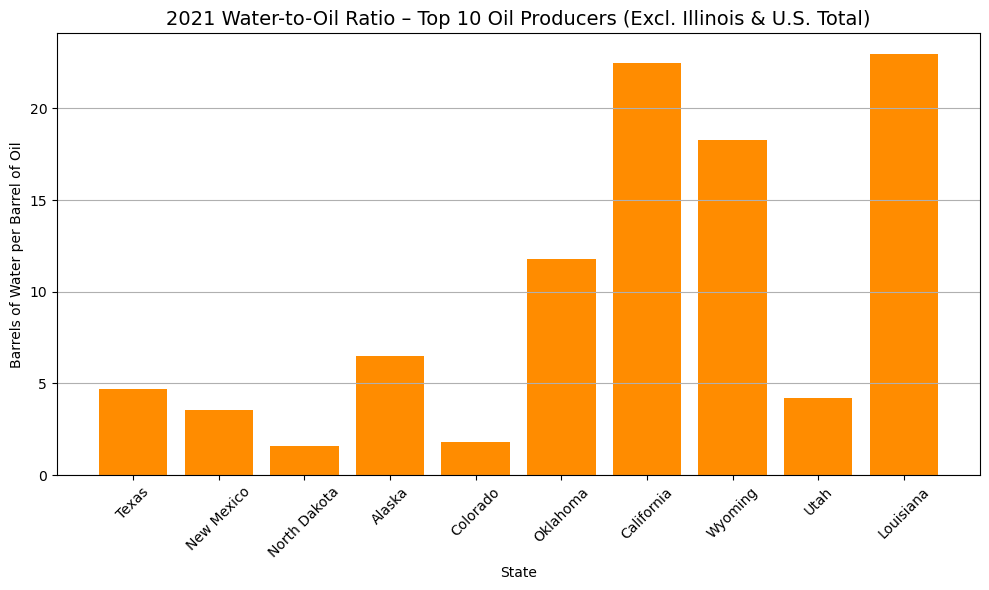
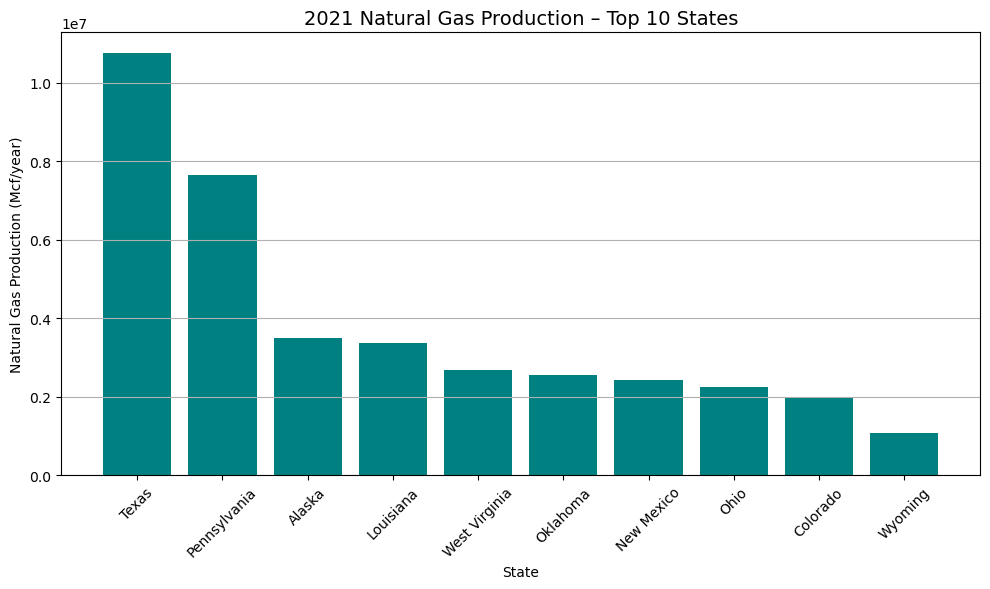
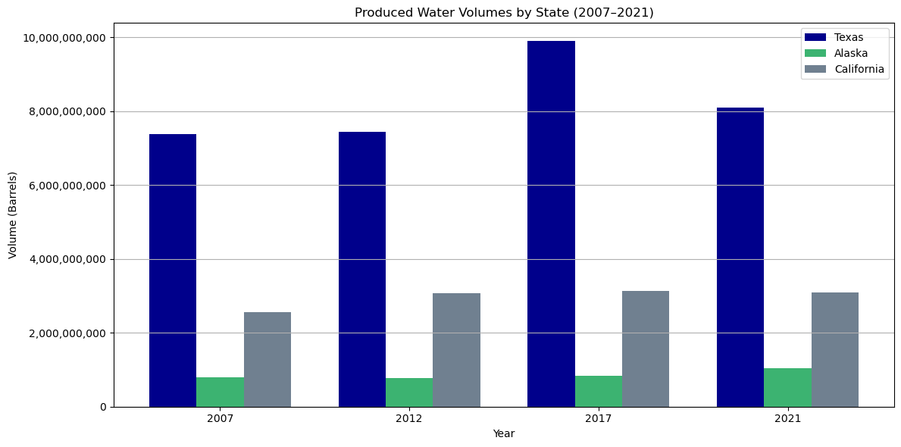
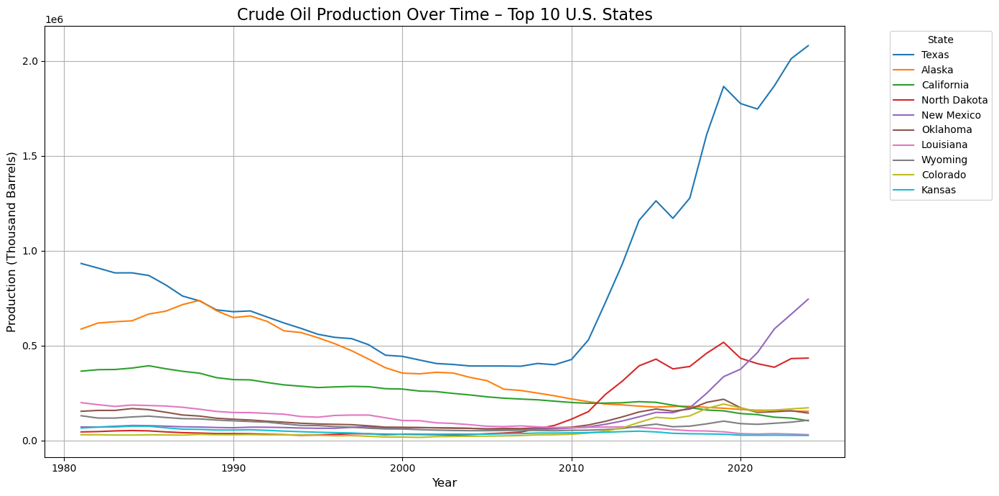
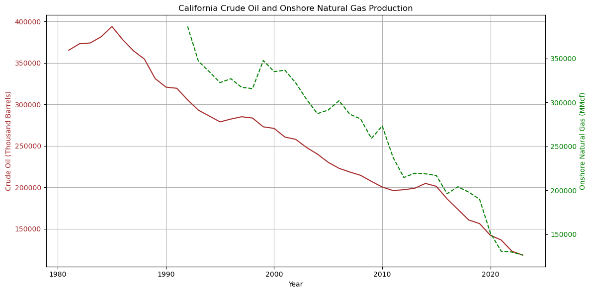
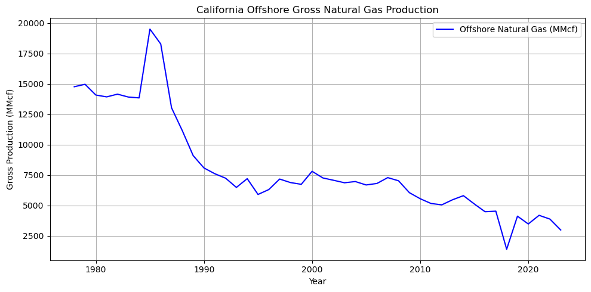

Produced water, crude oil and condensate, natural gas production in the United States. 
Exploratory data analysis.
Tracy A. Davis
April 24, 2025

Crude oil and natural gas data for the U.S. and California were downloaded from the U.S. Energy Information Administration on April 24, 2025 at: https://www.eia.gov/petroleum/data.php and https://www.eia.gov/dnav/ng/ng_prod_sum_dc_NUS_mmcf_a.htm

Comparisons of crude oil and condensate, natural gas, and produced water volumes in the U.S. were available from the Groundwater Protection Council for years 2021, 2017, 2012, and 2007 at: https://www.gwpc.org/wp-content/uploads/2021/09/2021_Produced_Water_Volumes.pdf

Data tables were edited in Microsoft Excel.

Python coding for exploratory data analysis was edited from coding provided by ChatGPT available at: https://chatgpt.com


```python
# import packages
import pandas as pd
import numpy as np
import matplotlib.pyplot as plt
```


```python
pw_df = pd.read_csv("state_pw.csv")
pw_df = pw_df.set_index("State")
print(pw_df.columns.tolist())
```

    ['crude_oil_bbl_yr_2007', 'crude_oil_bbl_yr_2012', 'crude_oil_bbl_yr_2017', 'crude_oil_bbl_yr_2021', 'produced_water_bbl_yr_2007', 'produced_water_bbl_yr_2012', 'produced_water_bbl_yr_2017', 'produced_water_bbl_yr_2021', 'natural_gas_mmcf_2007', 'natural_gas_mmcf_2012', 'natural_gas_mmcf_2017', 'natural_gas_mmcf_2021']


```python
water_column_2021 = "produced_water_bbl_yr_2021"
oil_column_2021 = "crude_oil_bbl_yr_2021"

pw_df[oil_column_2021] = pd.to_numeric(pw_df[oil_column_2021].str.replace(',', ''), errors='coerce')
pw_df[water_column_2021] = pd.to_numeric(pw_df[water_column_2021].str.replace(',', ''), errors='coerce')

# Extract total oil and water production columns
all_oil_2021 = pw_df[oil_column_2021]
all_water_2021 = pw_df[water_column_2021]

```


```python
# Drop Illinois and U.S. Total Rounded
excluded_states = ["Illinois", "U.S. Total Rounded"]
oil_2021_cleaned = all_oil_2021.drop(excluded_states, errors="ignore")
water_2021_cleaned = all_water_2021.drop(excluded_states, errors="ignore")
```


```python
# Get top 10 states by natural gas production
top_10_water_states = water_2021_cleaned.sort_values(ascending=False).head(10)

# Plot 2021 top ten states natural gas production
plt.figure(figsize=(10, 6))
plt.bar(top_10_water_states.index, top_10_water_states.values, color='teal')
plt.title("2021 Produced water Production – Top 10 States", fontsize=14)
plt.ylabel("Produced water (bbl/year)")
plt.xlabel("State")
plt.xticks(rotation=45)
plt.grid(axis='y')
plt.tight_layout()
plt.show()
```


    

    


```python
# Get top 10 oil-producing states
top_10_oil_states_cleaned = oil_2021_cleaned.sort_values(ascending=False).head(10)
top_10_oil_names_cleaned = top_10_oil_states_cleaned.index
```


```python
# Corresponding water production and ratio
water_2021_top_10_oil_cleaned = water_2021_cleaned.loc[top_10_oil_names_cleaned]
ratio_top_10_oil_cleaned = water_2021_top_10_oil_cleaned / top_10_oil_states_cleaned
```


```python
# Plot water-oil ratio for top ten states in 2021 crude oil production
plt.figure(figsize=(10, 6))
plt.bar(ratio_top_10_oil_cleaned.index, ratio_top_10_oil_cleaned.values, color='darkorange')
plt.title("2021 Water-to-Oil Ratio – Top 10 Oil Producers (Excl. Illinois & U.S. Total)", fontsize=14)
plt.ylabel("Barrels of Water per Barrel of Oil")
plt.xlabel("State")
plt.xticks(rotation=45)
plt.grid(axis='y')
plt.tight_layout()
plt.show()

```


    

    


```python
# Identify the 2021 natural gas production column
gas_column_2021 = "natural_gas_mmcf_2021"

# Convert the gas production column to numeric (remove commas, handle missing)
pw_df[gas_column_2021] = pd.to_numeric(pw_df[gas_column_2021].str.replace(',', ''), errors='coerce')

# Drop rows for Illinois and U.S. Total
gas_2021_cleaned = pw_df[gas_column_2021].drop(["Illinois", "U.S. Total Rounded"], errors="ignore")

# Get top 10 states by natural gas production
top_10_gas_states = gas_2021_cleaned.sort_values(ascending=False).head(10)

# Plot 2021 top ten states natural gas production
plt.figure(figsize=(10, 6))
plt.bar(top_10_gas_states.index, top_10_gas_states.values, color='teal')
plt.title("2021 Natural Gas Production – Top 10 States", fontsize=14)
plt.ylabel("Natural Gas Production (Mcf/year)")
plt.xlabel("State")
plt.xticks(rotation=45)
plt.grid(axis='y')
plt.tight_layout()
plt.show()
```


    

    


```python
pw_df = pd.read_csv("state_pw.csv")
pw_df = pw_df.set_index("State")

# Check if "State" is the index
state_index = pw_df.index.name == "State"

# Extract produced water values using .loc if "State" is the index
if state_index:
    tx_row = pw_df.loc[["Texas"]]
    ak_row = pw_df.loc[["Alaska"]]
    ca_row = pw_df.loc[["California"]]
else:
    tx_row = pw_df[pw_df["State"] == "Texas"]
    ak_row = pw_df[pw_df["State"] == "Alaska"]
    ca_row = pw_df[pw_df["State"] == "California"]

# Recreate required variables from the data
comparison_years = [2007, 2012, 2017, 2021]
pw_columns = [f"produced_water_bbl_yr_{year}" for year in comparison_years]


# Extract produced water volumes for each state
tx_pw = [int(tx_row[col].values[0].replace(",", "")) for col in pw_columns]
ak_pw = [int(ak_row[col].values[0].replace(",", "")) for col in pw_columns]
ca_pw = [int(ca_row[col].values[0].replace(",", "")) for col in pw_columns]

# X locations for bars
x = np.arange(len(comparison_years))
width = 0.25

# Plot grouped bar chart for produced water
plt.figure(figsize=(12, 6))
plt.bar(x - width, tx_pw, width, label="Texas", color="darkblue")
plt.bar(x, ak_pw, width, label="Alaska", color="mediumseagreen")
plt.bar(x + width, ca_pw, width, label="California", color="slategray")

plt.xticks(x, comparison_years)
plt.title("Produced Water Volumes by State (2007–2021)")
plt.xlabel("Year")
plt.ylabel("Volume (Barrels)")
plt.legend()
plt.grid(True, axis="y")
plt.gca().get_yaxis().set_major_formatter(plt.FuncFormatter(lambda x, _: f"{int(x):,}"))  # Comma formatting
plt.tight_layout()
plt.show()

```


    

    


```python
# Load the dataset (adjust path if needed)
df = pd.read_csv("crudeoil_annual.csv")
print(df.columns.tolist())
```

    ['Date', 'U.S. Field Production of Crude Oil (Thousand Barrels)', 'East Coast (PADD 1) Field Production of Crude Oil (Thousand Barrels)', 'Florida Field Production of Crude Oil (Thousand Barrels)', 'New York Field Production of Crude Oil (Thousand Barrels)', 'Pennsylvania Field Production of Crude Oil (Thousand Barrels)', 'Virginia Field Production of Crude Oil (Thousand Barrels)', 'West Virginia Field Production of Crude Oil (Thousand Barrels)', 'Midwest (PADD 2) Field Production of Crude Oil (Thousand Barrels)', 'Illinois Field Production of Crude Oil (Thousand Barrels)', 'Indiana Field Production of Crude Oil (Thousand Barrels)', 'Kansas Field Production of Crude Oil (Thousand Barrels)', 'Kentucky Field Production of Crude Oil (Thousand Barrels)', 'Michigan Field Production of Crude Oil (Thousand Barrels)', 'Missouri Field Production of Crude Oil (Thousand Barrels)', 'Nebraska Field Production of Crude Oil (Thousand Barrels)', 'North Dakota Field Production of Crude Oil (Thousand Barrels)', 'Ohio Field Production of Crude Oil (Thousand Barrels)', 'Oklahoma Field Production of Crude Oil (Thousand Barrels)', 'South Dakota Field Production of Crude Oil (Thousand Barrels)', 'Tennessee Field Production of Crude Oil (Thousand Barrels)', 'Gulf Coast (PADD 3) Field Production of Crude Oil (Thousand Barrels)', 'Alabama Field Production of Crude Oil (Thousand Barrels)', 'Arkansas Field Production of Crude Oil (Thousand Barrels)', 'Louisiana Field Production of Crude Oil (Thousand Barrels)', 'Mississippi Field Production of Crude Oil (Thousand Barrels)', 'New Mexico Field Production of Crude Oil (Thousand Barrels)', 'Texas Field Production of Crude Oil (Thousand Barrels)', 'Federal Offshore--Gulf of America Field Production of Crude Oil (Thousand Barrels)', 'Rocky Mountain (PADD 4) Field Production of Crude Oil (Thousand Barrels)', 'Colorado Field Production of Crude Oil (Thousand Barrels)', 'Idaho Field Production of Crude Oil (Thousand Barrels)', 'Montana Field Production of Crude Oil (Thousand Barrels)', 'Utah Field Production of Crude Oil (Thousand Barrels)', 'Wyoming Field Production of Crude Oil (Thousand Barrels)', 'West Coast (PADD 5) Field Production of Crude Oil (Thousand Barrels)', 'Alaska Field Production of Crude Oil (Thousand Barrels)', 'Alaska South Field Production of Crude Oil (Thousand Barrels)', 'Alaska North Slope Crude Oil Production (Thousand Barrels)', 'Arizona Field Production of Crude Oil (Thousand Barrels)', 'California Field Production of Crude Oil (Thousand Barrels)', 'Nevada Field Production of Crude Oil (Thousand Barrels)', 'Federal Offshore PADD 5 Field Production of Crude Oil (Thousand Barrels)']


```python
# Use correct date column
df["Date"] = pd.to_numeric(df["Date"], errors="coerce")
df = df.dropna(subset=["Date"])

# List of state columns (extracted from column names)
state_columns = [col for col in df.columns if "Field Production of Crude Oil" in col and "Federal" not in col and "PADD" not in col and "U.S." not in col]

# Compute total production per state
state_totals = {col: df[col].sum(skipna=True) for col in state_columns}

# Get top 10 states by total production
top_10_cols = sorted(state_totals, key=state_totals.get, reverse=True)[:10]
top_10_labels = [col.replace(" Field Production of Crude Oil (Thousand Barrels)", "") for col in top_10_cols]

# Plot production over time for the top 10 states
plt.figure(figsize=(14, 7))
for col, label in zip(top_10_cols, top_10_labels):
    plt.plot(df["Date"], df[col], label=label)

plt.title("Crude Oil Production Over Time – Top 10 U.S. States", fontsize=16)
plt.xlabel("Year", fontsize=12)
plt.ylabel("Production (Thousand Barrels)", fontsize=12)
plt.legend(title="State", bbox_to_anchor=(1.05, 1), loc='upper left')
plt.tight_layout()
plt.grid(True)
plt.show()

```


    

    


```python
# Load the dataset (adjust path if needed)
oil_gas_df = pd.read_csv("naturalgas_annual_ca_us.csv")
print(oil_gas_df.columns.tolist())
```

    ['Date', 'ca_crudeoil_thousandbarrels', 'ca_offshore_gross_mmcf', 'ca_offshore_gross_fromgaswells_mmcf', 'ca_offshore_gross_fromoilwells_mmcf', 'ca_offshore_repressuring_mmcf', 'ca_offshore_ventflare_mmcf', 'ca_offshore_nonhydrocarbon_mmcf', 'ca_offshore_marketed_mmcf', 'ca_offshore_drygas_mmcf', 'ca_onshore_gross_mmcf', 'ca_onshore_fromgaswells_mmcf', 'ca_onshore_fromoilwells_mmcf', 'ca_onshore_gross_shale_mmcf', 'ca_onshore_coalbed_mmcf', 'ca_onshore_repressuring_mmcf', 'ca_onshore_ventflare_mmcf', 'ca_onshore_nonhydrocarbon_mmcf', 'ca_onshore_marketed_mmcf', 'ca_onshore_drygas_mmcf', 'us_onshore_gross_mmcf', 'us_onshore_fromgaswells_mmcf', 'us_onshore_fromoilwells_mmcf', 'us_onshore_gross_shale_mmcf', 'us_onshore_coalbed_mmcf', 'us_onshore_repressuring_mmcf', 'us_onshore_ventflare_mmcf', 'us_onshore_nonhydrocarbon_mmcf', 'us_onshore_marketed_mmcf', 'us_onshore_gasplantliquids_mmcf', 'us_onshore_drygas_mmcf']


```python
# Use the correct column names from the dataset
crude_col = "ca_crudeoil_thousandbarrels"
onshore_gas_col = "ca_onshore_gross_mmcf"
offshore_gas_col = "ca_offshore_gross_mmcf"

# Plot crude oil and onshore natural gas with dashed line for gas
fig, ax1 = plt.subplots(figsize=(12, 6))

# Crude oil on left y-axis
ax1.set_xlabel("Year")
ax1.set_ylabel("Crude Oil (Thousand Barrels)", color="brown")
ax1.plot(oil_gas_df["Date"], oil_gas_df[crude_col], label="Crude Oil", color="brown")
ax1.tick_params(axis='y', labelcolor="brown")
ax1.grid(True)

# Onshore natural gas on right y-axis with dashed line
ax2 = ax1.twinx()
ax2.set_ylabel("Onshore Natural Gas (MMcf)", color="green")
ax2.plot(oil_gas_df["Date"], oil_gas_df[onshore_gas_col], label="Onshore Gas", color="green", linestyle="--")
ax2.tick_params(axis='y', labelcolor="green")

# Title and layout
plt.title("California Crude Oil and Onshore Natural Gas Production")
fig.tight_layout()
plt.show()
```


    

    


```python
# Plot only offshore gross natural gas production for California
plt.figure(figsize=(10, 5))
plt.plot(oil_gas_df["Date"], oil_gas_df[offshore_gas_col], label="Offshore Natural Gas (MMcf)", color="blue")

plt.title("California Offshore Gross Natural Gas Production")
plt.xlabel("Year")
plt.ylabel("Gross Production (MMcf)")
plt.grid(True)
plt.legend()
plt.tight_layout()
plt.show()


```


    

    


```python

```
